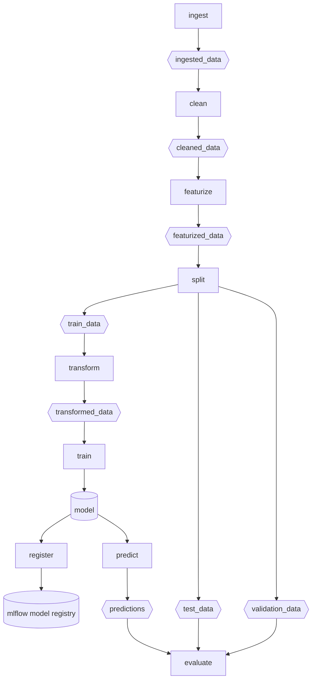
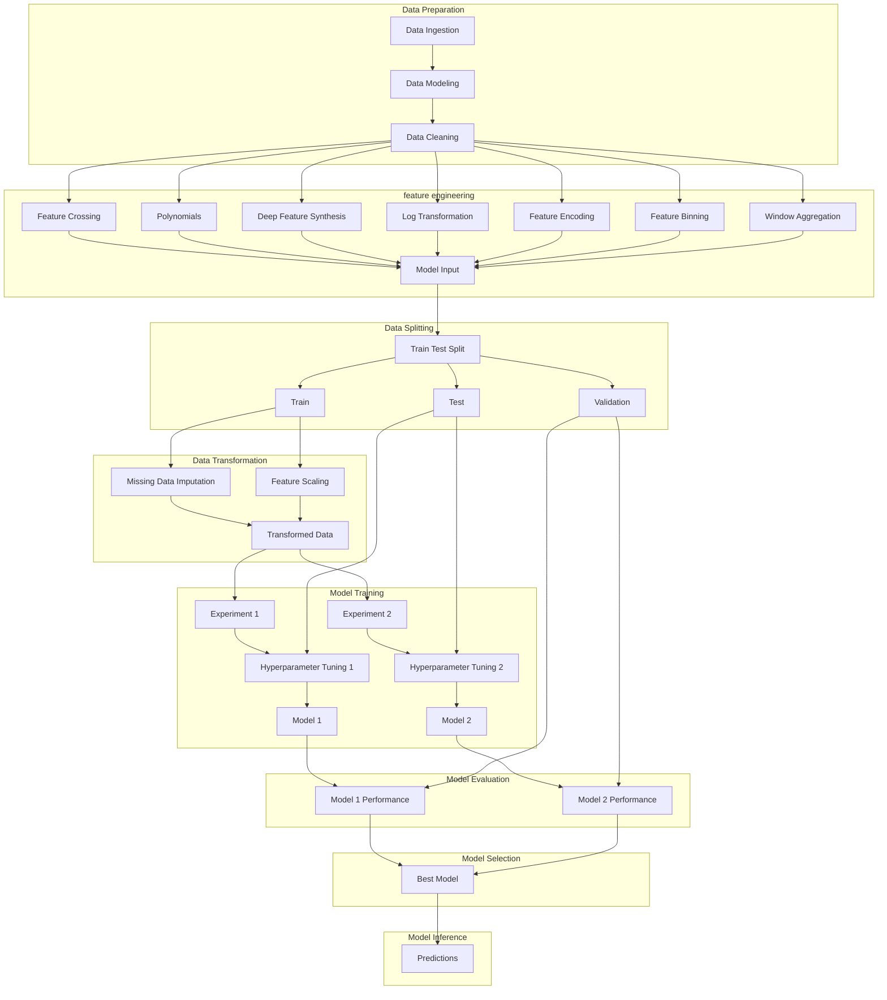

# magical-thinking

This "magical thinking" repository is meant to show how a data science project can be set up to be reproducible, scalable, and easy for data scientists to use without having to reinvent the wheel and make the same decisions over and over again.

Instead of using real data science code and performing actual modeling activity, we can use "magical thinking" to write functions that make sense from a design perspective and worry about the implementation and testing later. The idea is to be able to really focus on the workflow ergonomics to design a better system rather than focusing on a specific application. 

Magical thinking asks the question "wouldn't it be nice if this function did X?" and then we can write a function and pretend it does X instead of spending our time on making it do X. This allows us to move on to the next function and come up with a completely designed system to evaluate and later flesh out the actual code.

## Defining and installing the environment

```bash
mamba env update --file env.yaml --prune
```

## Prefect

Prefect is a tool for task orchestration that allows for retries after failures in the DAG.

To run the flow, first define the flow in prefect_flow.py, then run the following command:

```python
python prefect_flow.py
```

To run the Prefect UI to inspect flows and flow runs, run the following command:

```bash
prefect server start
```

After the server is running, navigate to this URI in your browser to view the UI:

- http://127.0.0.1:4200

## Adapting Prefect workflow to MLflow Recipes



## Workflow



## SKLearn Pipeline


## MLflow Recipes Classification Template

MLflow has something called [Recipes](https://mlflow.org/docs/latest/recipes.html) that provides a template for a DAG that can be used to train and evaluate a model. These steps happen in a sequence that helps to ensure there is no target leakage and assists with refactoring the data preparation and model training steps into a robust workflow.

The template is shown below:


